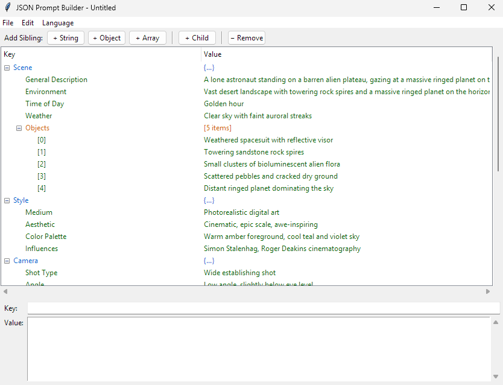

# JSON Prompt Builder

A lightweight GUI tool for creating and editing structured JSON prompts for AI image and video generation. Built with Python and Tkinter — no external dependencies required.


## Features

- **Visual JSON tree editor** — view and edit your prompt structure as an expandable tree
- **Inline editing** — double-click any key or value to edit it directly
- **Value suggestions** — when editing a value whose key matches a predefined entry (e.g. Lens, Shot type, Weather), a filterable dropdown appears with suggested values
- **Drag-and-drop reordering** — drag items up or down to reorder them within the same parent
- **Copy and paste** — right-click to copy any item (including nested objects/arrays) and paste it as a sibling
- **Detail panel** — a resizable panel below the tree displays the full text of long values with word wrap
- **Add / remove fields** — toolbar buttons and right-click context menu to add siblings, children, objects, and arrays
- **Type conversion** — convert any field between String, Number, Boolean, Null, Object, and Array via right-click
- **Example templates** — built-in examples optimized for AI image and video generation (File > Load Example)
- **Multi-language UI** — English and French out of the box, with easy extensibility
- **Persistent preferences** — language choice is saved to `user.ini` and restored on next launch
- **Keyboard shortcuts** — Ctrl+N, Ctrl+O, Ctrl+S, Insert, Delete, and more



## Quick Start

**Prerequisites:** Python 3.7 or later (Tkinter is included with standard Python installations).

### Windows

Double-click `JSON_Prompt_Builder.bat`, or run from terminal:

```
python main.py
```

### macOS / Linux

Double-click `JSON_Prompt_Builder.command`, or run from terminal:

```
python3 main.py
```

## Usage

| Action | How |
|---|---|
| Edit a key or value | Double-click it in the tree |
| Edit long text | Select the item and use the detail panel at the bottom |
| Add a sibling field | Select an item, then click **+ String**, **+ Object**, or **+ Array** |
| Add a child field | Select a container (object/array), then click **+ Child** |
| Remove a field | Select it and click **- Remove** or press `Delete` |
| Reorder items | Drag an item up or down among its siblings |
| Copy an item | Right-click > **Copy** |
| Paste an item | Right-click > **Paste** (inserts as a sibling, does not overwrite) |
| Change field type | Right-click > **Convert To** > choose type |
| Load an example | **File > Load Example** > choose a template |
| Switch language | **Language** menu > choose language |
| Clear everything | **Edit > Clear All** |

## Keyboard Shortcuts

| Shortcut | Action |
|---|---|
| `Ctrl+N` | New file (reset to default template) |
| `Ctrl+O` | Open JSON file |
| `Ctrl+S` | Save |
| `Ctrl+Shift+S` | Save As |
| `Insert` | Add sibling |
| `Delete` | Remove selected item |

## Example JSON Output

```json
{
    "Scene": {
        "General Description": "A lone astronaut on an alien plateau",
        "Environment": "Desert landscape with rock spires",
        "Time of Day": "Golden hour",
        "Weather": "Clear sky",
        "Objects": [
            "Weathered spacesuit",
            "Bioluminescent alien flora"
        ]
    },
    "Style": {
        "Medium": "Photorealistic digital art",
        "Aesthetic": "Cinematic, epic scale",
        "Color Palette": "Warm amber foreground, cool teal sky"
    },
    "Camera": {
        "Shot Type": "Wide establishing shot",
        "Angle": "Low angle",
        "Lens": "24mm wide-angle",
        "Depth of Field": "Deep focus"
    },
    "Lighting": {
        "Key Light": "Warm directional sunlight",
        "Atmosphere": "Volumetric light rays"
    },
    "Technical": {
        "Resolution": "8K",
        "Aspect Ratio": "16:9"
    }
}
```

## Project Structure

```
JSON_Prompt_Builder/
├── main.py                  # Entry point
├── app.py                   # Main window, menus, toolbar
├── json_tree.py             # Tree widget with inline editing & detail panel
├── file_handler.py          # JSON file I/O
├── config.py                # Constants and default template loader
├── locale_handler.py        # Multi-language support
├── user_settings.py         # Persistent user preferences (user.ini)
├── tooltip.py               # Hover tooltip widget
├── JSON_Prompt_Builder.bat  # Windows launcher
├── JSON_Prompt_Builder.command  # macOS launcher
├── examples/                # Example prompt templates
│   ├── simple_example.json
│   ├── simple_example_FR.json
│   ├── default_image.json
│   ├── default_image_FR.json
│   ├── default_video.json
│   └── default_video_FR.json
└── locale/                  # UI translation & suggestion files
    ├── en.json
    ├── fr.json
    ├── suggestion_en.json   # Value suggestions (English)
    └── suggestion_fr.json   # Value suggestions (French)
```

## Adding a New Language

1. Copy `locale/en.json` to `locale/xx.json` (where `xx` is the language code)
2. Translate all the string values, including the `"language_name"` key (this is displayed in the Language menu)
3. Optionally create `locale/suggestion_xx.json` with value suggestions for that language's keys (English suggestions are always available as a base)
4. Optionally create `examples/simple_example_XX.json` for a localized default template and add the mapping in `config.py` under `_TEMPLATE_FILES`

The new language will automatically appear in the **Language** menu. No code changes are required.

## Value Suggestions

The app provides value suggestions for common prompt keys. When you double-click to edit a value, if the key matches an entry in the suggestion file, a dropdown appears with predefined options. You can pick a suggestion or type a custom value.

Suggestion files are stored in `locale/` as `suggestion_xx.json`. English suggestions are always loaded as a base, with the active language's suggestions merged on top.

**Built-in suggestion keys:** Lens, Shot type, Weather, Time of Day, Medium, Angle

To add custom suggestions, edit the appropriate `locale/suggestion_xx.json` file. The format is:

```json
{
    "Key Name": ["Option 1", "Option 2", "Option 3"]
}
```

Key matching is case-insensitive.

## Adding Custom Examples

Drop any `.json` file into the `examples/` folder. It will automatically appear under **File > Load Example** the next time you open the menu. File names are displayed with underscores replaced by spaces and title-cased (e.g., `my_custom_prompt.json` shows as "My Custom Prompt").

## License

MIT
